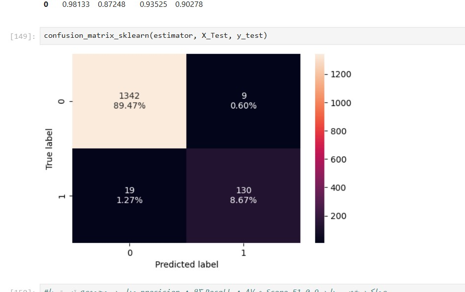
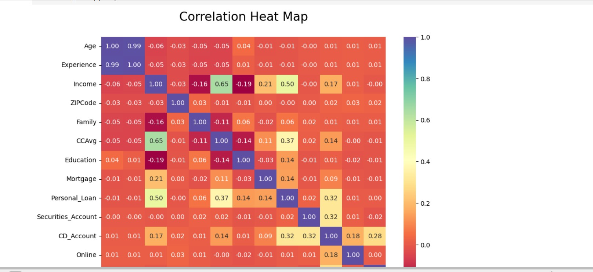
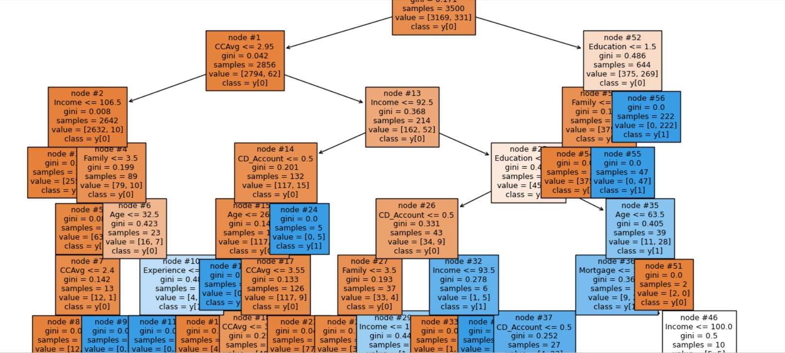
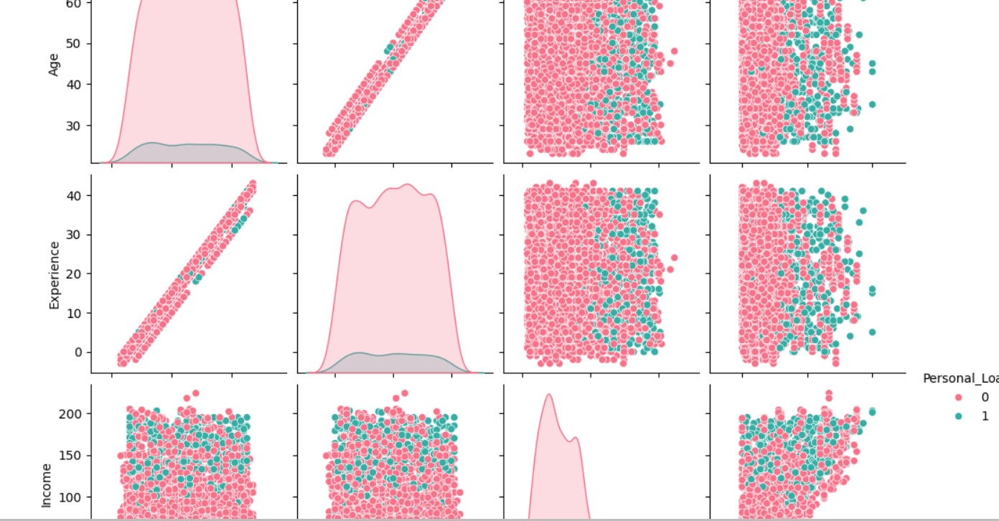
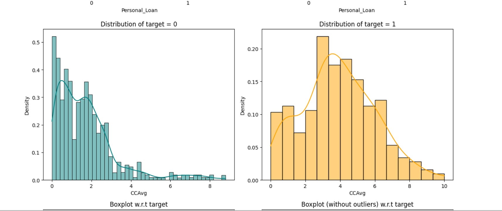

# پیش‌بینی پذیرش وام شخصی — مدل‌های رگرسیون لجستیک و درخت تصمیم

این پروژه بر اساس داده‌های تمرین سایت **Kaggle** ساخته شده و هدف آن پیش‌بینی پذیرش یا عدم پذیرش وام شخصی توسط مشتریان بانک است.  
در این پروژه دو مدل یادگیری ماشین پیاده‌سازی و مقایسه شده‌اند:

- رگرسیون لجستیک (Logistic Regression) با تنظیم آستانه (Threshold)
- درخت تصمیم (Decision Tree) با هرس پس از آموزش (Post-Pruning)

---

## 🎯 هدف پروژه
هدف اصلی این پروژه، به‌کارگیری مدل‌های طبقه‌بندی برای کمک به تیم بازاریابی بانک است تا بتوانند مشتریانی را شناسایی کنند که احتمال پذیرش وام شخصی در آن‌ها بیشتر است.

---

## 📈 نتایج کلیدی

| مدل | Precision | Recall | F1 Score | Accuracy |
|------|------------|---------|-----------|-----------|
| رگرسیون لجستیک (Threshold=0.37) | 0.77 | 0.71 | 0.74 | 0.93 |
| درخت تصمیم (Post-Pruned) | 0.93 | 0.90 | 0.91 | 0.98 |

📌 **مدل درخت تصمیم پس از هرس‌کردن بهترین عملکرد را داشت.**

---

## 💡 بینش‌های بازاریابی

- مشتریان **۳۵ تا ۴۰ ساله**، با **خانواده‌ی ۱ نفره یا بیشتر** و **تحصیلات کارشناسی یا بالاتر**، بیشترین احتمال پذیرش وام را دارند.  
- مشتریان دارای **حساب بلندمدت (CD Account)** و **میانگین خرج کارت اعتباری بالا (CCAvg)** اهداف خوبی هستند اما نیازمند ارزیابی ریسک هستند.  
- مشتریان با **سابقه کاری بالا** و **کاربران صرفاً اینترنتی**، تمایل کمی به دریافت وام دارند.

---

## 🧰 نحوه اجرا

1. کلون کردن مخزن:
   ```bash
   git clone https://github.com/YOUR_USERNAME/personal-loan-prediction.git
   cd personal-loan-prediction
   ```

2. نصب پیش‌نیازها:
   ```bash
   pip install -r requirements.txt
   ```

3. اجرای JupyterLab:
   ```bash
   jupyter lab
   ```

4. اجرای نوت‌بوک‌ها به ترتیب:
   - `logistic_regression_model.ipynb`
   - `decision_tree_model.ipynb`

---
##عکسهای پروژه











## ✍️ نویسنده

**Bahar**  
علاقه‌مند به علم داده و تحلیل تصمیمات واقعی  
📬 [اطلاعات تماس یا لینکدین]:r.nasehi88@gmail.com
